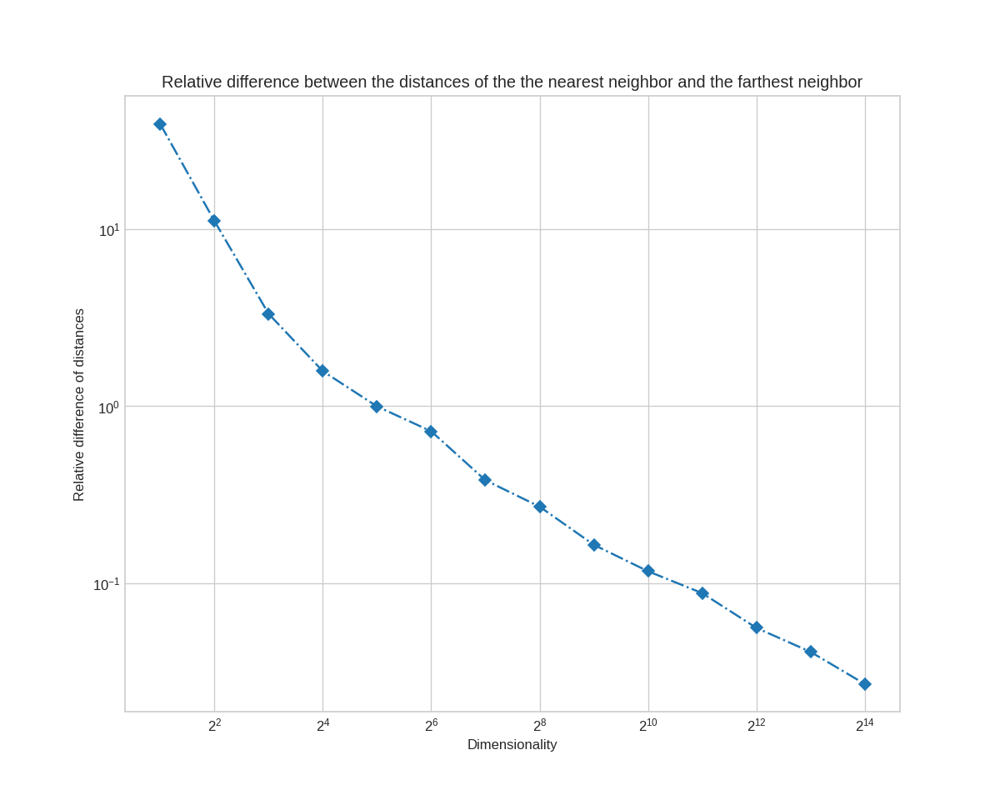

# Curse of Dimensionality

This repo shows a phenomenon in high dimensionality where distance functions loss their usefulness. In high dimensional space, the difference between the minimum and the maximum distance between a random query point $Q \in \mathbb{R}^n$ and a set of $n$ random data points $X_1, X_2, \cdots, X_n \in \mathbb{R}^n$ becomes indiscernible.

$$ \lim_{\text{dim}\to \infty}E\left[\frac{dist_{max} - dist_{min}}{dist_{min}}\right]\to 0 $$

This can be shown in the figure below.

## References
- [Curse of dimensionality](https://en.wikipedia.org/wiki/Curse_of_dimensionality)
- [Lecture 11: High Dimensional Geometry, Curse of Dimensionality, Dimension Reduction](https://www.cs.princeton.edu/courses/archive/fall13/cos521/lecnotes/lec11.pdf)
